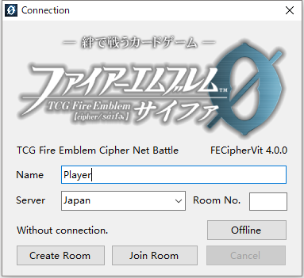
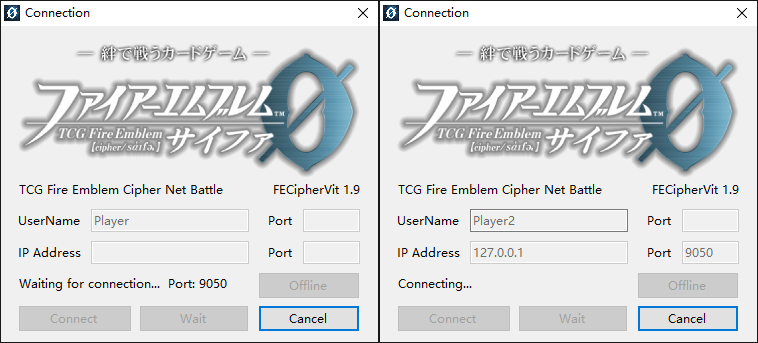

# Connection

You may choose one of the following schemes to connect to your friends.

**A.Via Server(recommended)**

FECipherVit provides a server for clients to link to.
IP: 123.56.176.97 (may change)

Run the main program "FECipher.exe" and type your player ID. 
Right click on the button "Connect", and then click on "Use default server" to get the IP address.

For player A, right click on the button "Connect", and then click on "Find valid port". If you are able to connect to the server, the port will be filled automatically. Then click on "Connect" to connect to the server.
For player B, type the same port number as player A got in the lower blank, and then click on "Connect".

If the link breaks down during a match, you may click on "game" → "connection" in the menu bar to open this window and try to connect again. Don’t close this program directly or you will lose your game progress.

You may watch battles between other players. After two players connected to the server, you can type the server IP, fill the lower port blank with the port number they are using , and click on "Connect" to watch the battle between them.

If you cannot connect to the server, please contact the writer (sder.colin@gmail.com).

**B.Connect to another player directly**

Make sure that at least one of the players has an IP address and opening ports in the Wide Area Network. You can also use a software like Hamachi to simulate a Local Area Network.

Run the main program "FECipher.exe" and type your player ID.

For player A, click on "Wait" and tell player B his IP address.
For player B, type A's IP address and click on "Connect".

Generally you don't need to fill the port blanks and you will be using the default port 9050. As you connect for several times, the port may change, and the other player should type the same port in the lower blank.

If the link breaks down during a match, you may click on "game" → "connection" in the menu bar to open this window and try to connect again. Don’t close this program directly or you will lose your game progress.

You may watch battles between other players. After two players connected to each other, you can type the IP address of the player who clicked "Wait", and fill the lower port blank with a valid port(the host player will see the valid port number in this window) and click on "connect" to watch the battle between them.
