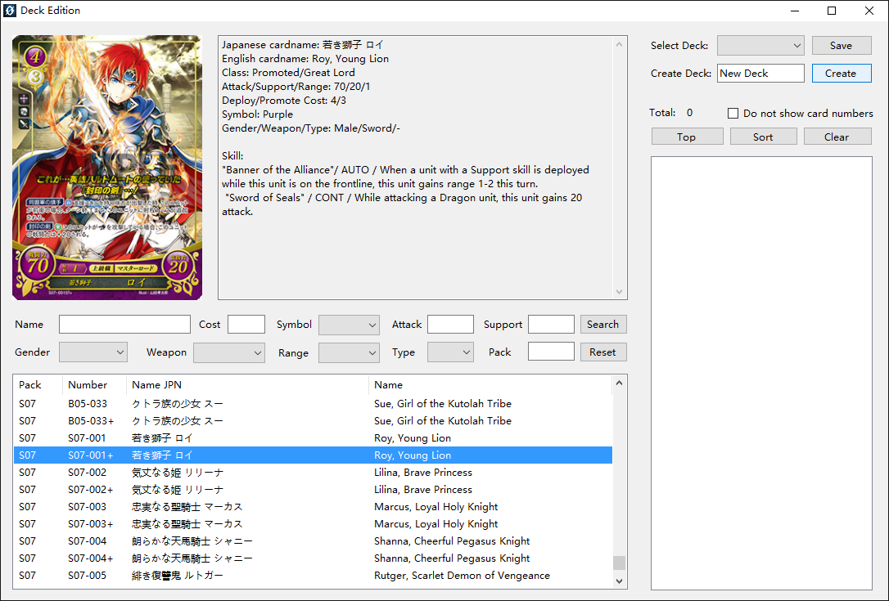
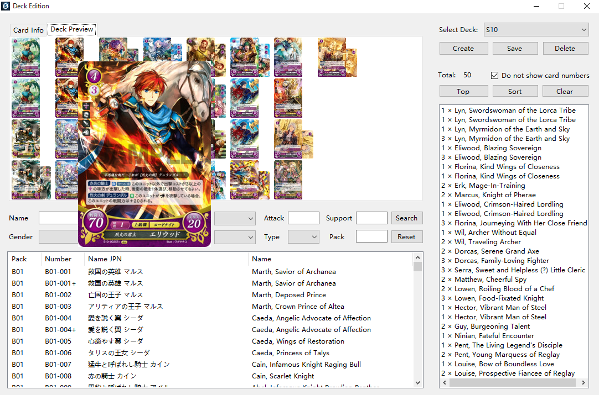

# Deck Edition

1. Click on "Other" → "Deck Edition" in the menu bar.
 
2. Choose an existing deck or create a new one by type a deck name and click on "Create".
 

3. Search for the cards you want in the left part of the window.

4. Double click on a card to add it to your deck.

5. When adjusting your deck, you may right click on a card to operate it, or double click on it to remove one card.

6. You can switch tag on the left up area to enter viewing mode so that you may check cards in your deck in pictures. Press the card to see its big picture.  

7. When viewing your deck, you may right click on a card to add one or right click it to remove one.

8. When viewing your deck, right click the blank space to open menu. Click "change alighment style" to change the alighment style. Click on "preview on a new window" to view the deck in a new window.

9. When your deck is done, you may click on "Sort" button to sort cards, and then click on "Top" button to make your 1C main character to the top.

10. We prepared 10 Starter Decks (S01-S10) for testing.
