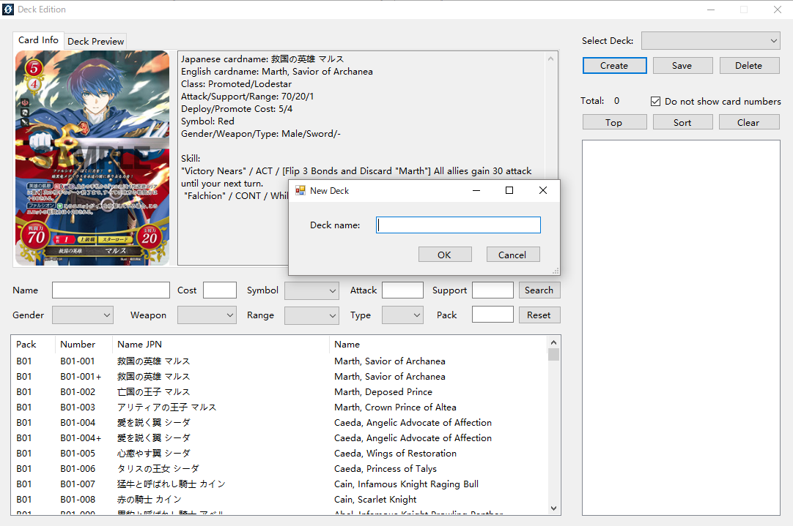

# Deck Edition

1. Click on "Other" → "Deck Edition" in the menu bar.
 
2. Choose an existing deck or click on "Create" to create a new deck.
 

3. Search for the cards you want in the left part of the window.

4. Double click on a card to add it to your deck.

5. When adjusting your deck, you may right click on a card to operate it, or double click on it to remove one card.

6. You can switch tag on the left top area to enter preview mode so that you may check contents of your deck in pictures. Long press the card to show it in a larger size.  

7. In preview mode, you may left click on a card to add one or right click it to remove one.

8. In preview mode, right click on the blank space of the preview panel to open menu for more displaying options.

9. You may click on "Sort" button to make the contents in a clearer order, and then click on "Top" button to move your 1C main character card to the top.

10. Be sure to click on "Save" button before you close this window.

11. We prepared 10 Starter Decks (S01-S10) for testing.
