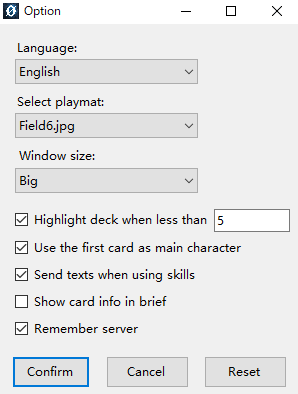

# Settings 
1. Choose language: Three languages are available: Chinese, English, Italian. Please choose the suitable language to play this game. Right now, only player using the same languages are able to have games.
2. Choose playmat: Your choice won't affect your opponent's display.
3. Window Size: Adjust the size of the main window.
4. Deck number warning: When the number of cards in Deck is not more than your input value, the card back image of Deck will be replaced by a red one. 
5. Use the first card in your deck as your main character: If you choose this, the first card in your deck will be your main character when the game start and you will not have to choose it everytime you start a game.
6. Sending texts while using a skill: If you choose this, the messages sended while the using the skill will contain the detailed content of the skill.
7. Show card info in brief: If you choose this, the card info shown on the left side will not be simplified.
8. Remember server: If you choose this, the program will remember the server last time you connected.

